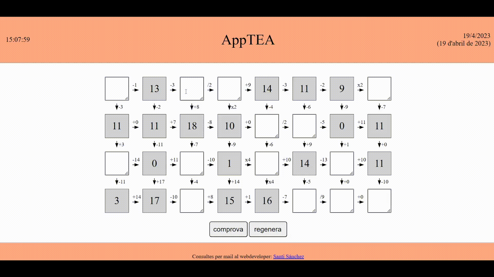

# INTRODUCTION

This is a web application I created using pure javascript, html and CSS in order to implement a popular exercise for students with Autism Spectrum Disorders to learn and practice basic math. I created it with the aim of automating one exercice for one of my former student in a secondary school center I worked as a Psychologist

You can see the live site at [https://blackcub3s.github.io/appTEA/](https://blackcub3s.github.io/appTEA/).

# USE CASE EXAMPLE

Down below you can see a time-lapse video of the application in operation:

